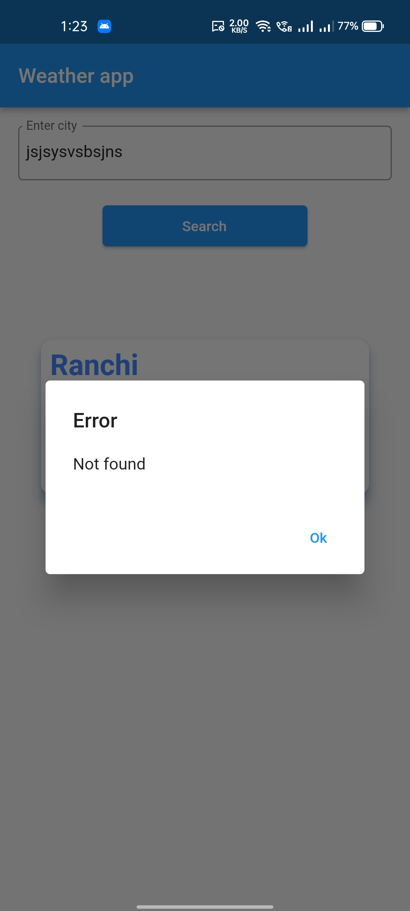
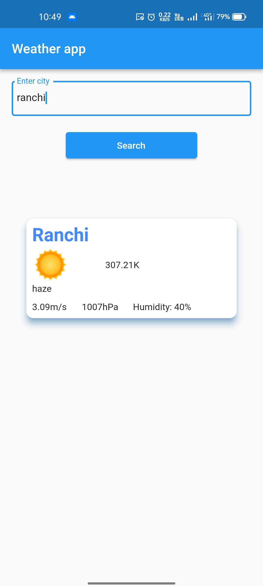
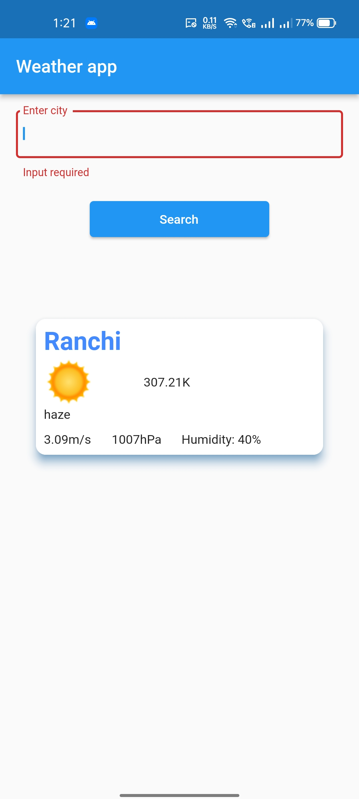

# WeatherApp
WeatherApp is Flutter application that enables viewing forecasts of cities all over the world.

## About
Flutter project that has it's own communication with Weather API. The API is based on the REST architecture and it is using Retrofit with GET method to get response from service. The results retrieved are structured in a JSON transport format. Fetched data is saved locally so the use of the application is enabled even without an internet connection.

## Features
The flutter app lets you:

- Search for the city for which you want to view the forecast
- Get weather from REST API
- Save weather of searched city to local storage
- Show saved weathers from local storage as a list on the screen
- Get error message in case of unsuccessful response

## Tech-stack
- flutter_bloc and equatable
- retrofit
- injectable, get_it
- floor
- flutter_intl

## Screenshots

## Permissions
WeatherApp requires the following permissions in AndroidManifest.xml:

- Internet permission is used because application code needs Internet access

### Android
- Open the project with your IDE/Code Editor
- Run it on simulator or real Android device

### iOS
- Open the project with Xcode
- Run it on simulator or real iOS device
- Do not forget to run "pod install" in ios directory to manage library dependencies for your Xcode project before building application on iOS device
